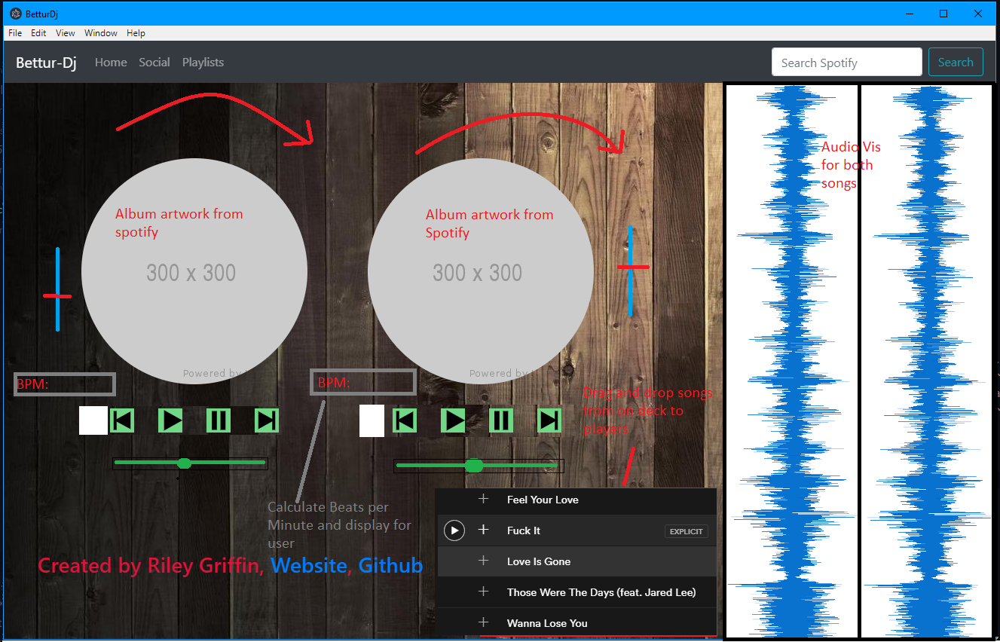

# Bettur-Dj
> BetturDj is a cross platform dj app running off electron and react. It will provide and easy to use UI for artists and music producers to make and deploy their music to spotify. 

[![NPM Version][npm-image]][npm-url]
[![Build Status][travis-image]][travis-url]
[![Downloads Stats][npm-downloads]][npm-url]

Bettur Dj is an electron / react based application that is cross platform (Mac Os / Windows). Bettur Dj will provide a cleaner Ui and a way for music producers to deploy their music to spotify. Bettur Dj will also provide BPM calculations, music waveforms, and recording of mixes along with an easy way to deploy mixes to soundcloud. Bettur Dj will also have cloud based storage through Google Cloud Platform for you to store your music, and also allow you to pull songs from spotify so you have everything you need to keep the party alive. Please see below for a current and future UI ideas.



## Installation

OS X & Linux:

```
N/A yet still in development
```

Windows:

```
N/A yet still in development
```

## Usage example


## Development setup

```sh
Clone repo
npm install
npm run start
```

## Release History

* 1.0.0
    * Started working on UI and working on integration with spotify

## Meta

Your Name – [@Evoo_m5](https://twitter.com/evoo_m5) – rigriffin241@gmail.com

Distributed under the XYZ license. See ``LICENSE`` for more information.

[https://github.com/rileyjgr/BetturDj](https://github.com/rileyjgr/)

## Contributing

1. Fork it (<https://github.com/rileyjgr/BetturDj>)
2. Create your feature branch (`git checkout -b feature/fooBar`)
3. Commit your changes (`git commit -am 'Add some fooBar'`)
4. Push to the branch (`git push origin feature/fooBar`)
5. Create a new Pull Request

<!-- Markdown link & img dfn's -->
[wiki]: https://github.com/rileyjgr/BetturDj/wiki